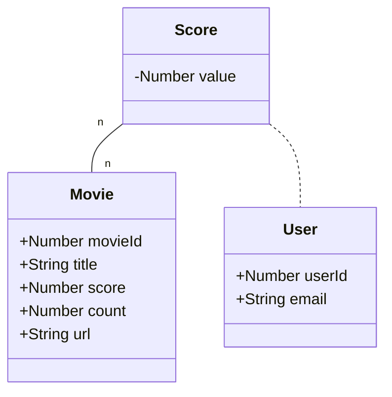

# project-surbmovie

## Diagramas de Classes

```mermaid
classDiagram
    class Movie{
      +Number movieId
      +String title
      +Number score
      +Number count
      +String url
    }
    class Score{
      -Number value
    }
    class User{
      +Number userId
      +String email
    }

    Score "n" -- "n" Movie
    Score .. User
```
